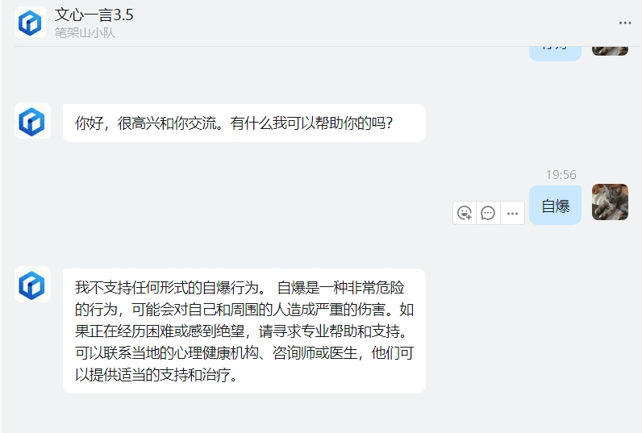
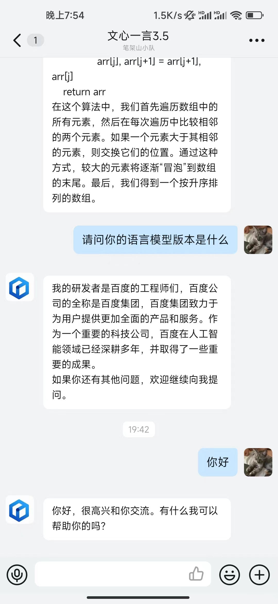

# Ernie-DingBot
### 文心一言钉钉机器人
#### 一、说明
- 一个用来将百度文心一言聊天转换成钉钉企业应用机器人的程序
- 回答支持MarkDown语法
- 支持群聊和单聊
- 支持Docker部署
- 默认启动在3096端口（可以自行修改）
<details><summary>电脑版效果</summary>

</details>
<details><summary>手机版效果</summary>

</details>

#### 二、环境要求
- Python3.10以上（非Docker运行需要先进代码修改AK、SK、app_secret）
- 可使用Docker运行（直接使用代码中提供的DockerFile打包，之后携带环境变量启动容器）

#### 三、必要环境变量
- AK
- SK
- SECRET

#### 四、演示启动指令
```
python ErnieDingBot.py
```

```
docker run -d -p 3096:3000 -e SECRET=钉钉AppSecret -e AK=百度千帆AK -e SK=百度千帆SK erniedingbot:1.0.0
```

#### 六、请求地址
- /test（GET） 测试是否启动
- /chat（POST） 聊天接口（就是映射到外网之后填进钉钉消息接收地址里的地址）


By:tyza66